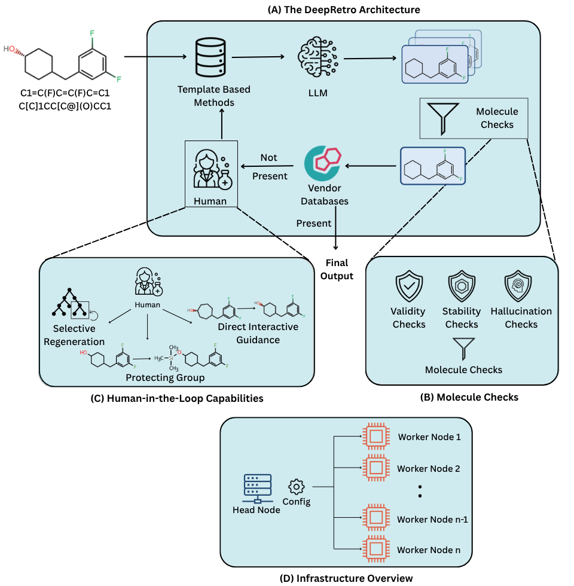
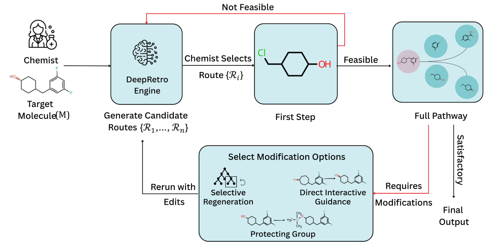

DeepRetro: Hybrid LLM Retrosynthesis Framework
==============================================

.. admonition:: DeepRetro Framework Overview
   :class: dropdown

   **(a) The DeepRetro framework:** The process starts with a template-based tool. If it fails, an LLM proposes steps, which undergo validation checks. If proposed molecules are not available in a vendor database, the molecule continues in the pipeline. It then moves into an optional human intervention before recursive evaluation.

   **(b) Molecule checks:** DeepRetro incorporates multiple checks, including Validity checks (valency, allowed atoms), Stability Checks (see Section 5), and Hallucination Checks (verifying that the LLM provides sensible outputs).

   **(c) Human interventions:** DeepRetro supports selective regeneration (regenerating erroneous parts), direct interactive guidance (chemists make small changes to fix hallucinations), and other interventions.

   **(d) Scalable architecture:** DeepRetro operates a head node that controls several worker nodes. The number of worker nodes can be scaled for complex syntheses.

Retrosynthesis—the identification of precursor molecules for a target compound—is pivotal for chemical synthesis, but discovering novel pathways beyond predefined templates remains a challenge.

**DeepRetro** is an open-source, hybrid retrosynthesis planning tool that combines the strengths of conventional template-based/MCTS tools with the generative power of Large Language Models (LLMs) in a step-wise, feedback-driven loop.

Key Features
------------

- **Hybrid Planning:** Integrates standard retrosynthesis tools with LLMs for iterative, stepwise pathway generation.
- **Dynamic Exploration:** If a standard tool fails, an LLM proposes single-step disconnections, which are rigorously checked for validity, stability, and hallucination.
- **Recursive Refinement:** Validated precursors are recursively fed back into the pipeline, enabling dynamic pathway exploration and correction.
- **Human-in-the-Loop:** A graphical user interface (GUI) allows expert chemists to inspect, edit, and provide feedback on generated pathways, controlling hallucinations and AI failures.
- **Open Source:** The DeepRetro framework and GUI are fully open source, enabling the community to replicate, extend, and apply the tool in drug discovery and materials science.

How It Works
------------

1. **Attempt Synthesis:** The system first tries to plan a synthesis using a standard tool.
2. **LLM Assistance:** If unsuccessful, an LLM suggests a single-step retrosynthetic disconnection.
3. **Rigorous Checks:** Each suggestion is checked for chemical validity, stability, and hallucination.
4. **Recursive Loop:** Validated precursors are recursively analyzed, allowing for dynamic and corrective exploration.
5. **Expert Feedback:** Chemists can inspect and refine pathways via the GUI, ensuring reliability and novelty.

.. admonition:: Chemist Procedure Overview
   :class: dropdown

   The chemist submits a molecule (M) to DeepRetro, which then generates multiple candidate routes (R1, ..., Rn). The chemist selects a route Ri and checks its feasibility. If it is not feasible, the chemist goes back and chooses another route Rj. If the first step is feasible, the chemist then evaluates the full pathway. If satisfactory, it is chosen as a final output. If the pathway requires modifications, the chemist chooses between modification options like selective regeneration, direct interactive guidance, or adding a protecting group. The chemist then reruns with the chosen edits, and the iterative procedure is repeated.

Why DeepRetro?
--------------

- Identifies viable and potentially novel retrosynthetic routes
- Enables more automated, reliable, and efficient synthesis planning
- Facilitates human-AI collaboration for complex molecule synthesis
- Open source for broad community use and extension

**Get Started**
---------------

.. list-table::
   :widths: 20 80
   :header-rows: 1

   * - Section
     - Description
   * - :doc:`quickstart`
     - Step-by-step guide to install, configure, and run DeepRetro.
   * - :doc:`installation`
     - Detailed installation instructions and system requirements.
   * - :doc:`user_guide`
     - Usage instructions, tips, and troubleshooting.
   * - :doc:`api_reference`
     - HTTP API endpoints, models, and error codes.
   * - :doc:`development`
     - Developer setup, contribution guidelines, and code structure.
   * - :doc:`contributing`
     - How to contribute to the project.
   * - :doc:`tutorial`
     - Step-by-step tutorial for using the DeepRetro GUI.

.. toctree::
   :maxdepth: 2
   :hidden:

   quickstart
   installation
   user_guide
   api_reference
   development
   contributing
   tutorial