Tutorial
========

This tutorial focuses on using the DeepRetro GUI for retrosynthesis
analysis and pathway visualization.

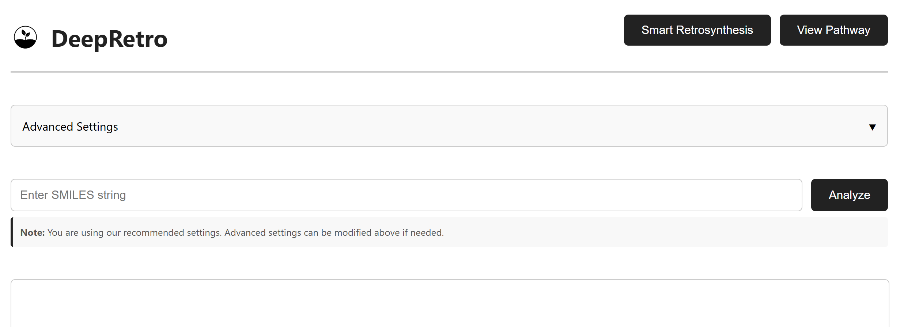

Getting Started
---------------

Prerequisites
~~~~~~~~~~~~~

- Run the DeepRetro backend server before opening the GUI.
- Keep a valid API key available for frontend access.
- Use a modern browser such as Chrome, Firefox, or Safari.

Setup
~~~~~

- Open ``viewer/index.html``.
- Enter your frontend API key when prompted.
- Choose an analysis mode: Smart Retrosynthesis or View Pathway.

Advanced Settings Configuration
~~~~~~~~~~~~~~~~~~~~~~~~~~~~~~~

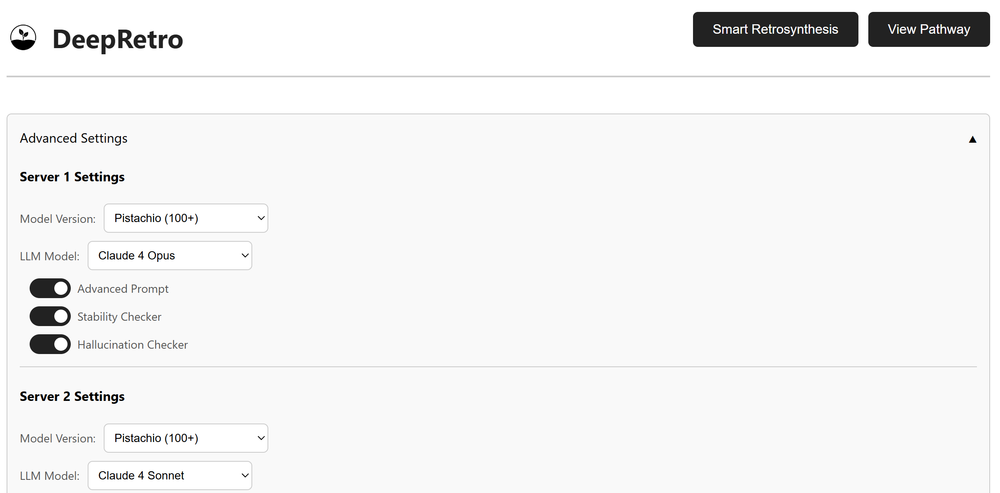

The advanced settings panel exposes the main controls for tuning a run.
The default configuration is usually a good starting point, but you can
adjust the LLM, backend model, and validation checks to match your use case.

LLM Selection::

   Claude 3 Opus, Claude 3.7 Sonnet, DeepSeek, Claude 4 Opus, Claude 4 Sonnet

Model Backend Selection::

   USPTO, Pistachio_25, Pistachio_50, Pistachio_100, Pistachio_100+

Validation Checks::

   Stability validation enable/disable, hallucination detection settings,
   and chemical feasibility assessment

SMILES Input and Configuration
------------------------------

Target Molecule Entry
~~~~~~~~~~~~~~~~~~~~~

The SMILES input interface allows you to enter the target molecule for
retrosynthesis analysis. This tutorial uses Cyanostilbene as an example::

   "COc1ccc(-c2ccc(/C=C(\\C#N)c3ccc(-c4ccncc4)cc3)cc2)cc1"

Click ``Analyze`` to start the retrosynthesis process. The system validates
the SMILES and begins pathway generation.

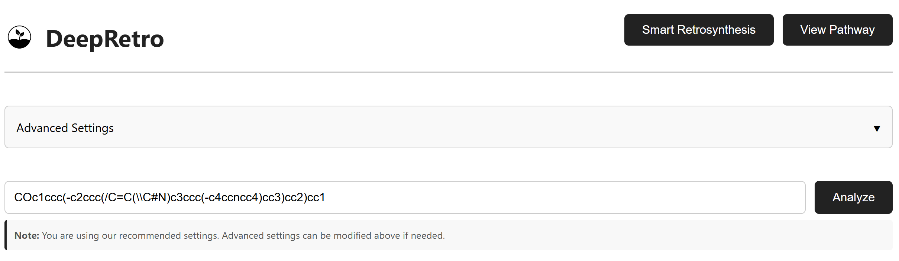

**Input Requirements**

Use valid SMILES notation (Simplified Molecular Input Line Entry System)
and choose a chemically feasible target molecule.

Visualization
-------------

Pathway Visualization
~~~~~~~~~~~~~~~~~~~~~

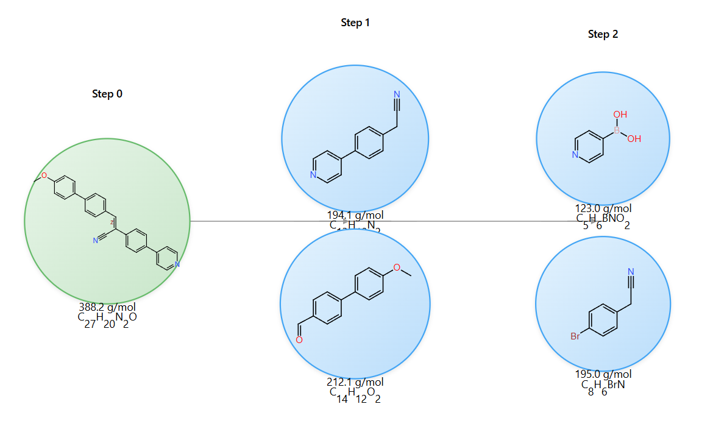

.. admonition:: Chemical Context: Cyanostilbene Synthesis
   :class: info

   The example demonstrates synthesis of a cyanostilbene derivative, a
   useful chromophore with aggregation-induced emission and donor-acceptor
   charge-transfer properties.

   **Two-step synthesis approach**

   - **Step 1 (Knoevenagel condensation)**: Introduces the cyano group and
     forms the final conjugated system.
   - **Step 2 (Suzuki coupling)**: Connects the donor and acceptor aromatic
     units.

Molecular Information
~~~~~~~~~~~~~~~~~~~~~

The visualization provides several interactive elements to help you explore
retrosynthesis pathways. Hover on any molecule node to view detailed
structural information, including molecular weight, chemical formula,
SMILES notation, and step metrics.

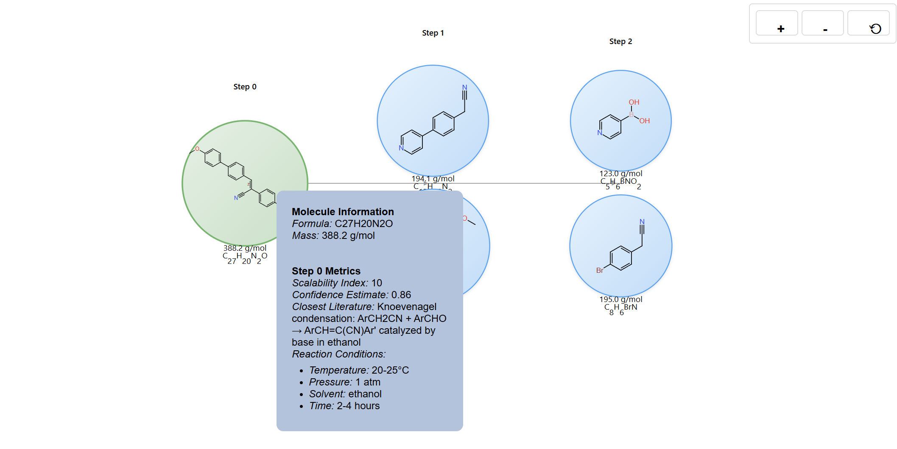

Hover on reaction edges to reveal reaction conditions and metrics, including
scalability index, confidence estimate, literature metadata, temperature,
and solvent information.

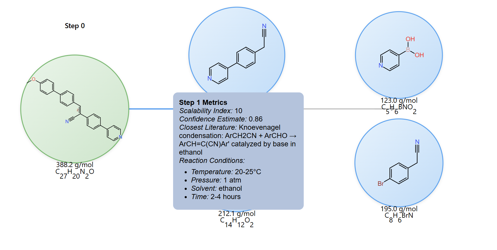

For complex reaction networks, the interface also supports pathway
switching, zooming, panning, and step-by-step inspection so you can
compare multiple routes side by side.

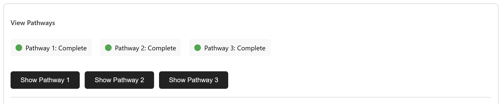

Interactive Editing
-------------------

Partial Re-run Analysis
~~~~~~~~~~~~~~~~~~~~~~~

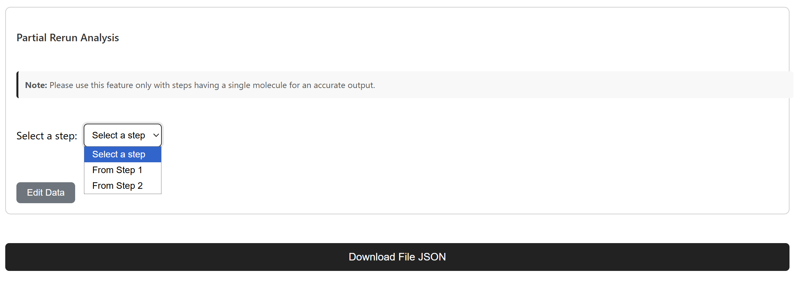

**Expert chemist intervention workflow**

An expert chemist can select a specific reaction step that needs
modification and generate new pathway branches from that point. This
supports targeted refinement while preserving successful parts of the route.

Manual Pathway Editing
~~~~~~~~~~~~~~~~~~~~~~

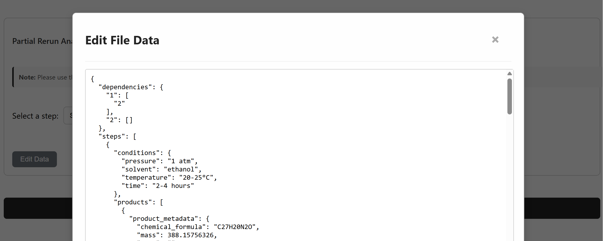

**Direct modification**

The interface supports manual condition editing, reagent substitution, and
protecting-group addition to refine and optimize reaction pathways. Use
``Edit Data`` to modify the JSON directly, and the pathway view updates
to reflect the changes.

File Management
---------------

Pathway File Management
~~~~~~~~~~~~~~~~~~~~~~~

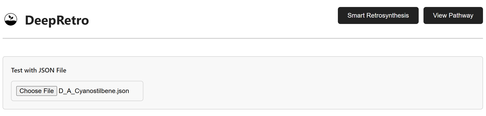

To upload and visualize existing pathways, click the ``View Pathway`` tab
and select a JSON file containing pathway data. The system loads and
validates the file before rendering the molecular pathway.

JSON Data Export
~~~~~~~~~~~~~~~~

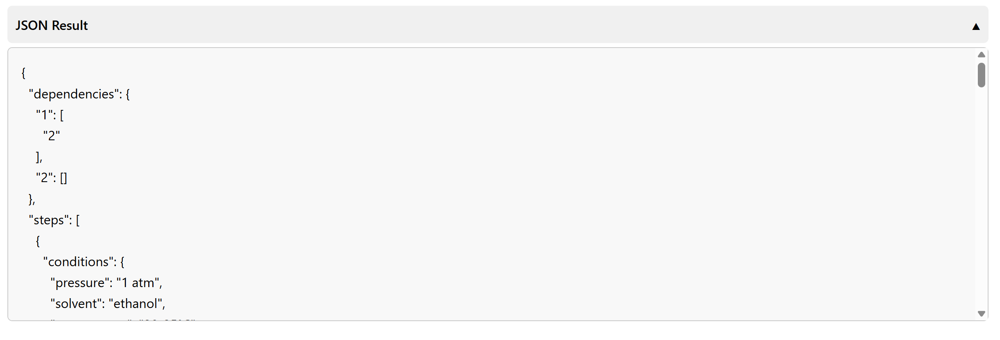

To export pathway data, click ``JSON Result`` to inspect the raw JSON and
then use the download control to save it for further analysis or storage.

Multiple Pathway Support
~~~~~~~~~~~~~~~~~~~~~~~~

The interface supports complex syntheses through pathway switching. You can
compare alternative routes, inspect their metrics, and choose the most
promising synthetic strategy for the target molecule.

Troubleshooting and Best Practices
----------------------------------

Troubleshooting
~~~~~~~~~~~~~~~

Common Issues and Solutions
^^^^^^^^^^^^^^^^^^^^^^^^^^^

- **API connection**: Verify the server is running, the API key is correct,
  and the configured URL is reachable.
- **SMILES errors**: Validate the syntax and confirm the target structure is
  chemically meaningful.
- **Visualization issues**: Refresh the page, clear cached assets if needed,
  and inspect the browser console for frontend errors.
- **File upload problems**: Confirm the uploaded file is valid JSON and uses
  the expected pathway schema.

Best Practices
~~~~~~~~~~~~~~

Optimization Guidelines
^^^^^^^^^^^^^^^^^^^^^^^

When working with DeepRetro, start with simple molecules to become familiar
with the system. Verify SMILES syntax before submitting a run, enable the
relevant validation checks for your use case, and review generated pathways
carefully before using them downstream.

For advanced usage, see :doc:`user_guide`, :doc:`api_reference`, and
:doc:`development`.
