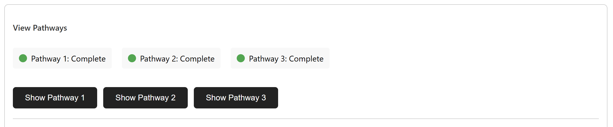

Tutorial
========

Using the DeepRetro GUI for Retrosynthesis Analysis and Pathway Visualization

A concise guide to retrosynthesis analysis and pathway visualization using the DeepRetro GUI interface.

Getting Started
--------------

Prerequisites
~~~~~~~~~~~~~

  - DeepRetro backend server running
  - API key for backend access
  - Modern web browser (Chrome/Firefox/Safari)

Setup
~~~~~

  - Navigate to `viewer/index.html`
  - Enter your API key when prompted
  - Choose your analysis mode

SMILES Input and Configuration
-----------------------------

Target Molecule Entry
~~~~~~~~~~~~~~~~~~~~~

**SMILES Input Process**

The SMILES input interface allows you to enter the target molecule for retrosynthesis analysis:

  - Enter SMILES notation for your target molecule in the input field
  - Example [Cyanostilbene]: ``COc1ccc(-c2ccc(/C=C(\\C#N)c3ccc(-c4ccncc4)cc3)cc2)cc1``
  - Click "Analyze" to start the retrosynthesis process
  - The system will validate the SMILES and begin pathway generation

**Input Requirements**

  - Valid SMILES notation (Simplified Molecular Input Line Entry System)
  - Chemically feasible target molecules
  - Maximum complexity suitable for retrosynthesis analysis

Chemical Context: Cyanostilbene Synthesis
~~~~~~~~~~~~~~~~~~~~~~~~~~~~~~~~~~~~~~~~~

The example demonstrates synthesis of a cyanostilbene derivative - a valuable chromophore with aggregation-induced emission (AIE) and strong donor–acceptor charge transfer properties.

**Two-Step Synthesis Approach**

  - **Step 1 (Knoevenagel Condensation)**: Introduces the cyano group, forming the final conjugated system
  - **Step 2 (Suzuki Coupling)**: Connects the donor and acceptor aromatic units

**Applications**

  - Sensing and light-harvesting applications
  - Photophysical and supramolecular research

Advanced Settings Configuration
~~~~~~~~~~~~~~~~~~~~~~~~~~~~~

Configure model parameters:

**LLM Selection**

  - Claude 3 Opus
  - Claude 3.7 Sonnet
  - DeepSeek
  - Claude 4 Opus
  - Claude 4 Sonnet

**Model Backend Selection**

  - USPTO
  - Pistachio_25
  - Pistachio_50
  - Pistachio_100
  - Pistachio_100+

**Validation Checks**

  - Stability validation enable/disable
  - Hallucination detection settings
  - Chemical feasibility assessment

**Reaction Conditions**

  - Temperature and pressure ranges
  - Solvent selection options
  - Time and catalyst parameters

Analysis and Visualization
-------------------------

Analysis Execution
~~~~~~~~~~~~~~~~~

  - Click "Analyze" to initiate retrosynthesis
  - Monitor progress through validation and processing
  - Results display as interactive visualization

Pathway Visualization
~~~~~~~~~~~~~~~~~~~~

.. image:: _static/tut11.png
   :alt: Pathway Visualization
   :align: center
   :width: 800px

Interactive graph features:

**Molecule Nodes**

  - Click for structural details
  - Molecular weight and formula display
  - SMILES notation access

**Reaction Edges**

  - Hover for conditions and metrics
  - Temperature and solvent information
  - Reagent and catalyst details
  - Success probability estimates

**Navigation Tools**

  - Pathway switching between routes
  - Zoom and pan for complex trees
  - Step-by-step progression view
  - Multiple pathway comparison

Molecular Information
~~~~~~~~~~~~~~~~~~~~

.. image:: _static/info.png
   :alt: Molecule Information Panel
   :align: center
   :width: 500px

Click any molecule node to view:

  - Molecular structure visualization
  - Chemical formula and mass calculation
  - SMILES notation display
  - Vendor database availability status

Reaction Details
~~~~~~~~~~~~~~~

Hover over reaction edges for:

**Conditions**

  - Temperature range and pressure
  - Solvent composition and volume
  - Reaction time and atmosphere

**Metrics**

  - Success probability estimates
  - Yield predictions and ranges
  - Literature references and citations

Interactive Editing
------------------

Partial Re-run Analysis
~~~~~~~~~~~~~~~~~~~~~~

Expert chemist intervention workflow:

**Step Selection**

  - Choose specific reaction step for modification

**Re-execution**

  - Generate new pathway branches from modified step

Manual Pathway Editing
~~~~~~~~~~~~~~~~~~~~~

.. image:: _static/edit.png
   :alt: Pathway Modification
   :align: center
   :width: 700px

Advanced editing capabilities:

**Selective Regeneration**

  - Regenerate problematic steps
  - Alternative route generation
  - Condition optimization

**Direct Modification**

  - Manual condition editing
  - Reagent substitution
  - Protecting group addition

File Management
---------------

Pathway File Management
~~~~~~~~~~~~~~~~~~~~~~

.. image:: _static/view.png
   :alt: File Upload Interface
   :align: center
   :width: 600px

Upload and visualize existing pathways:

  - Click "View Pathway" tab
  - Select JSON file or drag-and-drop
  - Automatic pathway loading and validation
  - Multiple pathway navigation and selection

JSON Data Export
~~~~~~~~~~~~~~~

Export and manage pathway data:

  - Click "JSON Result" to view raw data
  - Copy complete pathway information
  - Save for further analysis or storage
  - Export individual pathways or complete datasets

Multiple Pathway Support
~~~~~~~~~~~~~~~~~~~~~~~

Handle complex syntheses:

**Pathway Switching**

  - Navigate between routes
  - Compare efficiency metrics
  - Evaluate synthetic complexity

**Data Management**

  - Export individual pathways
  - Batch processing capabilities
  - Complete dataset export

Troubleshooting and Best Practices
---------------------------------

Troubleshooting
~~~~~~~~~~~~~~

Common Issues and Solutions
^^^^^^^^^^^^^^^^^^^^^^^^^^

  - **API Connection**
    - Solution: Verify server running and API key correct
    - Verification: Check network and URL configuration

  - **SMILES Errors**
    - Solution: Validate syntax and chemical validity
    - Verification: Check chemical structure

  - **Visualization Issues**
    - Solution: Refresh page and check browser console
    - Verification: Modern browser and cache clearing

  - **File Upload Problems**
    - Solution: Verify format
    - Verification: UTF-8 encoding and valid JSON structure

Best Practices
~~~~~~~~~~~~~

Optimization Guidelines
^^^^^^^^^^^^^^^^^^^^^^

**Input Validation**

  - Start with simple molecules
  - Verify SMILES syntax
  - Check chemical validity

**Model Configuration**

  - Use appropriate model settings
  - Enable relevant validation checks
  - Optimize for specific molecule types

**Result Management**

  - Review and validate pathways
  - Export important results
  - Document modifications and rationale

**Performance Optimization**

  - Use Chrome or Firefox
  - Maintain stable connection
  - Keep files under 10MB

Next Steps
----------

After completing this tutorial:

  - Perform retrosynthesis analysis
  - Upload and visualize pathways
  - Use advanced settings effectively
  - Implement human-in-the-loop workflows
  - Troubleshoot common issues

For advanced usage: :doc:`user_guide`, :doc:`api_reference`, :doc:`development` 