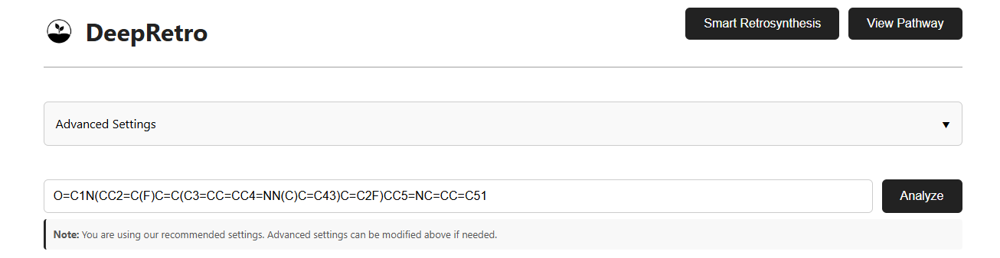
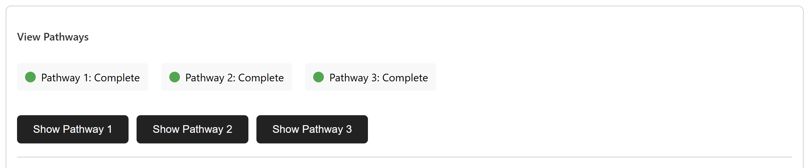
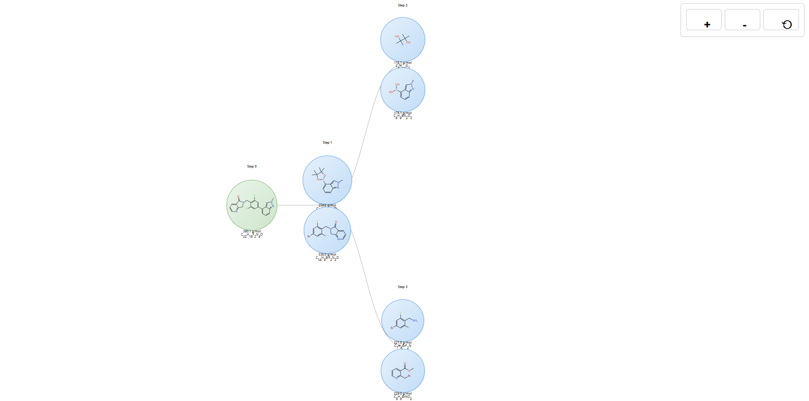
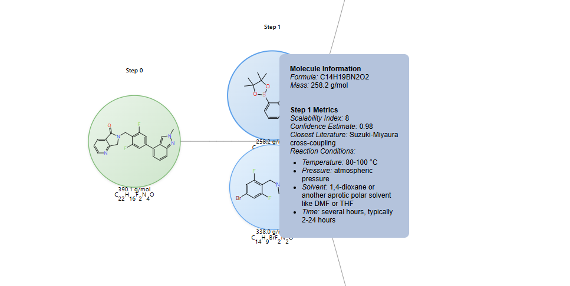

.. title:: Tutorial 2

Tutorial 2: Interactive Retrosynthesis Analysis
==============================================

Welcome to the DeepRetro GUI! In this tutorial, we'll walk through analyzing and visualizing a retrosynthetic pathway for a bioactive heterocyclic compound. Let us see how to interact with the system to explore chemical retrosynthesis routes.

Setting Up Your Workspace
-------------------------

Before we dive into the analysis, you'll need the DeepRetro backend server running and an API key for access. Once you have those, simply navigate to `viewer/index.html` in your browser. The system will greet you with a prompt for your API key. Enter it and you're ready to start!

Analysis
----------------------------

Imagine you're working on a kinase inhibitor project and need to understand how to synthesize a complex heterocyclic compound. The molecule we'll analyze is: ``O=C1N(CC2=C(F)C=C(C3=CC=CC4=NN(C)C=C43)C=C2F)CC5=NC=CC=C51``

This SMILES string represents 6-(2,6-Difluoro-4-(2-methyl-2H-indazol-4-yl)benzyl)-6,7-dihydro-5H-pyrrolo[3,4-b]pyridin-5-one, a bioactive compound with potential therapeutic applications. Type this into the input field and click "Analyze" to start the journey.

What Happens During Analysis
---------------------------

When you click "Analyze," the system springs into action. It first validates your SMILES string to ensure it's chemically meaningful, then begins the process of working backwards from your target molecule. The system explores various synthetic routes, evaluating the feasibility of each pathway.

The system doesn't just generate one route. These multiple generated routes explore multiple possibilities, considering factors like reaction conditions and reagent availability.

Exploring Your Results
---------------------

Once the analysis completes, you'll see an interactive graph showing the retrosynthetic pathway.

.. admonition:: Chemical Context: Kinase Inhibitor Synthesis
   :class: info

   In this case, the system identified a two-step synthesis approach. The first step involves a Suzuki coupling reaction, where the 2-methylindazole moiety connects to the difluorobenzene ring.

   The second step is a simple SN2 reaction on the secondary amine group of the pyrrolopyridine core. This straightforward transformation completes the synthesis, giving you access to your target compound.

Interactive Exploration
---------------------

The DeepRetro interface is interactive. You can hover on any molecule node to dive deeper into its structure and properties. Hover over reaction arrows to discover the specific conditions and success metrics for each transformation.

The reaction metdata includes molecular formulae, structural details, SMILES representations, and even confidence scores that tell you how reliable the predictions are.

The system also allows you to export your pathway as a JSON file.

Beyond the Basics
-----------------

This tutorial has shown you the fundamentals, but DeepRetro offers much more. You can explore alternative synthesis routes, modify reaction conditions, and even perform partial reruns to optimize specific steps. The system supports advanced features like selective regeneration and direct interactive guidance, allowing you to fine-tune the pathway.

For those interested in finer granular control, the system includes advanced settings for model selection, stability checks, and hallucination detection.
For advanced editing, troubleshooting, or more detailed features, refer to :doc:`Tutorial 1 <tutorial>`. 
