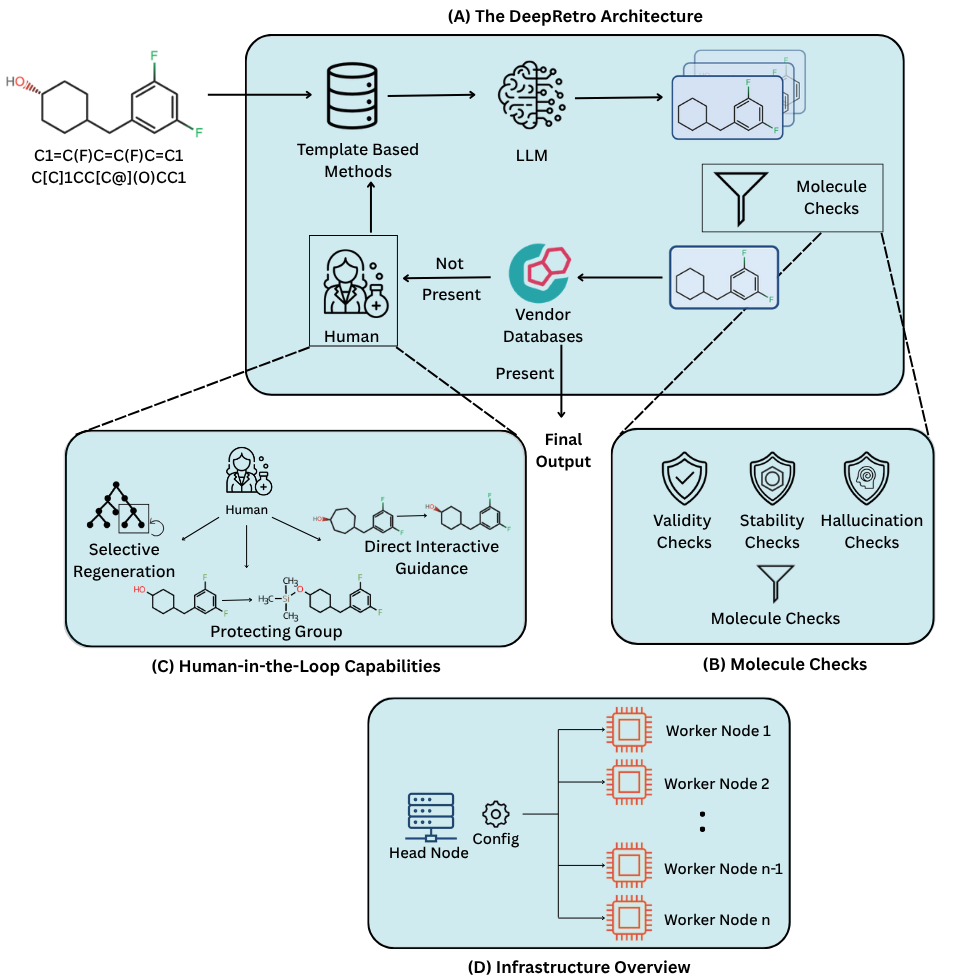
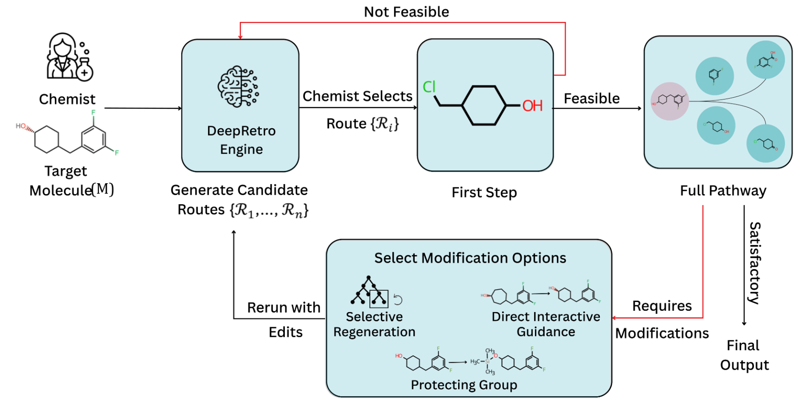

# DeepRetro - AI-Powered Retrosynthesis Tool

<p align="center">
  
</p>

<details>
<summary><strong>DeepRetro Framework Overview</strong> (click to expand)</summary>

**(a) The DeepRetro framework:** The process starts with a template-based tool. If it fails, an LLM proposes steps, which undergo validation checks. If proposed molecules are not available in a vendor database, the molecule continues in the pipeline. It then moves into an optional human intervention before recursive evaluation.

**(b) Molecule checks:** DeepRetro incorporates multiple checks, including Validity checks (valency, allowed atoms), Stability Checks (see Section 5), and Hallucination Checks (verifying that the LLM provides sensible outputs).

**(c) Human interventions:** DeepRetro supports selective regeneration (regenerating erroneous parts), direct interactive guidance (chemists make small changes to fix hallucinations), and other interventions.

**(d) Scalable architecture:** DeepRetro operates a head node that controls several worker nodes. The number of worker nodes can be scaled for complex syntheses.

</details>

Retrosynthesis—the identification of precursor molecules for a target compound—is pivotal for chemical synthesis, but discovering novel pathways beyond predefined templates remains a challenge.

**DeepRetro** is an open-source, hybrid retrosynthesis planning tool that combines the strengths of conventional template-based/MCTS tools with the generative power of Large Language Models (LLMs) in a step-wise, feedback-driven loop.

## Key Features

- **Hybrid Planning:** Integrates standard retrosynthesis tools with LLMs for iterative, stepwise pathway generation.
- **Dynamic Exploration:** If a standard tool fails, an LLM proposes single-step disconnections, which are rigorously checked for validity, stability, and hallucination.
- **Recursive Refinement:** Validated precursors are recursively fed back into the pipeline, enabling dynamic pathway exploration and correction.
- **Human-in-the-Loop:** A graphical user interface (GUI) allows expert chemists to inspect, edit, and provide feedback on generated pathways, controlling hallucinations and AI failures.
- **Open Source:** The DeepRetro framework and GUI are fully open source, enabling the community to replicate, extend, and apply the tool in drug discovery and materials science.

## How It Works

1. **Attempt Synthesis:** The system first tries to plan a synthesis using a standard tool.
2. **LLM Assistance:** If unsuccessful, an LLM suggests a single-step retrosynthetic disconnection.
3. **Rigorous Checks:** Each suggestion is checked for chemical validity, stability, and hallucination.
4. **Recursive Loop:** Validated precursors are recursively analyzed, allowing for dynamic and corrective exploration.
5. **Expert Feedback:** Chemists can inspect and refine pathways via the GUI, ensuring reliability and novelty.

<p align="center">
  
</p>

<details>
<summary><strong>Chemist Procedure Overview</strong> (click to expand)</summary>

The chemist submits a molecule (M) to DeepRetro, which then generates multiple candidate routes (R1, ..., Rn). The chemist selects a route Ri and checks its feasibility. If it is not feasible, the chemist goes back and chooses another route Rj. If the first step is feasible, the chemist then evaluates the full pathway. If satisfactory, it is chosen as a final output. If the pathway requires modifications, the chemist chooses between modification options like selective regeneration, direct interactive guidance, or adding a protecting group. The chemist then reruns with the chosen edits, and the iterative procedure is repeated.

</details>

## What is DeepRetro?

DeepRetro performs retrosynthesis analysis by:
- Taking a target molecule (in SMILES format) as input
- Using AI models (Claude 3, DeepSeek-R1) to predict possible precursor molecules
- Integrating with AiZynthFinder for reaction pathway validation
- Providing interactive visualization of reaction trees
- Supporting multiple model configurations and validation checks

## Quick Setup

### Prerequisites

- Python 3.9
- Conda or Miniconda
- Git

### Step 1: Clone and Setup

```bash
git clone <repository-url>
cd recursiveLLM

# Create conda environment
conda env create -f environment.yml
conda activate deepretro
```

### Step 2: Install Models

```bash
# Create models directory
mkdir aizynthfinder/models

# Download USPTO models (free)
python -c "from aizynthfinder.utils.download_public_data import download_public_data; download_public_data('aizynthfinder/models/')"
```

### Step 3: Configure Environment

Create a `.env` file in the project root:

```bash
# Backend API Key (required)
API_KEY=your-secure-backend-api-key

# LLM API Keys (required for your chosen models)
ANTHROPIC_API_KEY=your-anthropic-key
FIREWORKS_API_KEY=your-fireworks-key
```

### Step 4: Start the Application

```bash
# Start backend (in one terminal)
python src/api.py

# Start frontend (in another terminal)
cd viewer
python -m http.server 8000
```

### Step 5: Access the Application

1. Open your browser and go to `http://localhost:8000`
2. Enter your API key when prompted
3. Start analyzing molecules!

## Usage

### Web Interface

1. **Smart Retrosynthesis**: Enter a SMILES string and click "Analyze"
2. **View Pathway**: Upload existing JSON pathway files
3. **Advanced Settings**: Configure model types and validation flags
4. **Interactive Visualization**: Explore reaction pathways with molecular structures
5. **Partial Rerun**: Edit and rerun specific steps in the pathway
6. **File Upload**: Load and visualize previously generated pathways

### Key Features

- **Interactive Pathway Visualization**: D3.js-based tree visualization with molecular structures
- **Partial Rerun Analysis**: Edit any step and regenerate the pathway from that point
- **Multiple Model Support**: Switch between Claude 3, Claude 3.7, and DeepSeek-R1 models
- **Validation Checks**: Stability and hallucination detection for reliable results
- **File Management**: Upload, view, and edit JSON pathway files
- **Advanced Settings**: Configure model parameters and validation flags

### API Endpoints

- `POST /api/retrosynthesis` - Perform retrosynthesis analysis
- `POST /api/rerun_retrosynthesis` - Rerun complete analysis
- `POST /api/partial_rerun` - Rerun from specific step
- `GET /api/health` - Health check
- `POST /api/clear_molecule_cache` - Clear molecule cache

### Example API Request

```bash
curl -X POST http://localhost:5000/api/retrosynthesis \
  -H "Content-Type: application/json" \
  -H "X-API-KEY: your-api-key" \
  -d '{
    "smiles": "CC(C)(C)OC(=O)N[C@@H](CC1=CC=CC=C1)C(=O)O",
    "model_type": "claude37",
    "advanced_prompt": true,
    "model_version": "USPTO",
    "stability_flag": true,
    "hallucination_check": true
  }'
```

## Model Configuration

### Supported LLM Models
- **Claude 4 Sonnet**: `claude-4-sonnet-20250514`
- **Claude 3 Opus**: `claude-3-opus-20240229`
- **Claude 3.7 Sonnet**: `anthropic/claude-3-7-sonnet-20250219`
- **DeepSeek-R1**: `fireworks_ai/accounts/fireworks/models/deepseek-r1`

### Supported AiZynthFinder Models
- **USPTO**: Standard USPTO reaction database (Free, publicly available)
- **Pistachio_25**: Pistachio model with 25% coverage (Requires permissions)
- **Pistachio_50**: Pistachio model with 50% coverage (Requires permissions)
- **Pistachio_100**: Pistachio model with 100% coverage (Requires permissions)
- **Pistachio_100+**: Enhanced Pistachio model (Requires permissions)

> **Note**: Only the USPTO model is freely available. Pistachio models require special access permissions.

### Validation Features
- **Stability Check**: Validates molecular stability
- **Hallucination Check**: Detects AI-generated invalid structures
- **Advanced Prompt**: Uses enhanced prompting for better results

## Troubleshooting

### Common Issues

1. **API Key Errors**
   - Ensure backend `.env` file has `API_KEY` set
   - Verify frontend is using the same API key

2. **Model Download Issues**
   - Ensure you have internet connection for model downloads
   - Check `aizynthfinder/models/` directory exists

3. **Port Conflicts**
   - Backend default: 5000
   - Frontend default: 8000

4. **LLM API Errors**
   - Verify API keys are valid and have sufficient credits
   - Check rate limits for your chosen LLM provider

## Development

### Running Tests

```bash
pip install -r tests/requirements_tests.txt
python -m pytest tests/
```

## License

This project is licensed under the MIT License.

## Contributing

We welcome contributions! Please feel free to submit a Pull Request. For major changes, please open an issue first to discuss what you would like to change.
